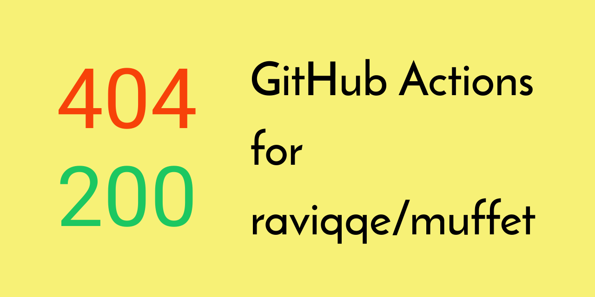

[](https://github.com/peaceiris/actions-muffet/blob/master/LICENSE)
[](https://github.com/peaceiris/actions-muffet/releases/latest)
[](https://github.com/peaceiris/actions-muffet/releases)


## GitHub Actions for muffet

- [raviqqe/muffet: Fast website link checker in Go](https://github.com/raviqqe/muffet)




## Getting started

### Create `main.workflow`

```sh
workflow "Main workflow" {
  on = "push"
  resolves = ["muffet"]
}

action "muffet" {
  uses = "peaceiris/actions-muffet@0.5.3"
  args = ["https://example.com"]
}
```


## License

[MIT License - peaceiris/actions-muffet]

[MIT License - peaceiris/actions-muffet]: https://github.com/peaceiris/actions-muffet/blob/master/LICENSE


## Supprt author

<a href="https://www.patreon.com/peaceiris"></a>
